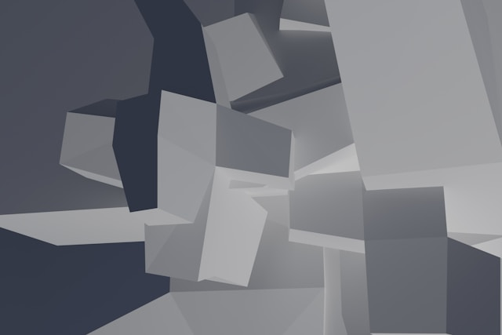

# odin-landing-page

Landing page project as per the Odin Project
course - [foundations-landing-page](https://www.theodinproject.com/lessons/foundations-landing-page)

# The Goal

The goal of the project is to replicate the below landing page:

# Information

# Improvements

In the future I could format the landing page to work better on mobile. The current format only really works on a wide
screen.

# Credit

Photo by <a href="https://unsplash.com/@steve_j?utm_content=creditCopyText&utm_medium=referral&utm_source=unsplash">
Steve Johnson</a>
on <a href="https://unsplash.com/photos/a-bunch-of-white-cubes-floating-in-the-air-PsPHRqO9XFg?utm_content=creditCopyText&utm_medium=referral&utm_source=unsplash">
Unsplash</a>
  
